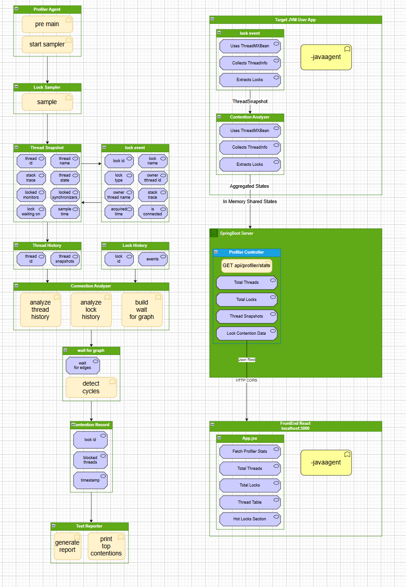

# Lock Contention Profiler - Backend

**Real-time JVM lock analysis, convoy detection, and hot-lock monitoring using Spring Boot.**

This backend collects JVM thread and lock snapshots, analyzes lock contention, and exposes REST APIs for a frontend dashboard or external monitoring tools.

---

## Table of Contents

1. [Project Overview](#project-overview)
2. [Core Data Classes](#core-data-classes)
3. [Analytics & Monitoring](#analytics--monitoring)
4. [Lock Hotness / Wave Analytics](#lock-hotness--wave-analytics)
5. [Optimization Features](#optimization-features)
6. [Thread / Lock Histories](#thread--lock-histories)
7. [Algorithmic Improvements](#algorithmic-improvements)
8. [Overall Time Complexity](#overall-time-complexity-per-session)
9. [REST API Endpoints](#rest-api-endpoints)
10. [Project Dependencies](#project-dependencies)
11. [Running the Server](#running-the-server)
12. [Optional Features](#optional-features)

---

## Project Overview

- **Backend Framework**: Spring Boot 3.2.x
- **Language**: Java 17+
- Collects **JVM thread snapshots** and **lock events** in real-time.
- Analyzes **lock contention**, **convoys**, and **hot locks** dynamically.
- Exposes a **REST API** for frontend dashboards or external tools.

---



---

## Core Data Classes

### ThreadSnapshot
- Fields: `threadId`, `threadName`, `threadState`, `stackTrace`, `lockedMonitors`, `lockedSynchronizers`, `lockWaitingOn`, `sampleTime`
- Methods:
    - `isBlocked()`
    - `getHeldLockCount()`
    - `toString()`

### LockEvent
- Fields: `lockId`, `lockName`, `lockType`, `ownerThreadId`, `ownerThreadName`, `stackTrace`, `acquiredTime`, `isContended`
- Methods:
    - `isOwned()`
    - `toString()`

### ContentionRecord
- Fields: `lockId`, `lockName`, `lockType`, `owningThreadId`, `owningThreadName`, `blockedThreadIds`, `blockedThreadNames`, `blockCount`, `uniqueWaiterCount`, `totalBlockedTime`, `maxSingleBlock`, `ownershipFrequency`, `maxOwnership`, `lastTimestamp`, `blockingStacks`
- Methods:
    - `hasContention()`
    - `severityScore()`
    - `isConvoy()`
    - `toString()`

### LockContentionAccumulator
- Tracks ongoing contention with dynamic updates.
- Fields: blocked threads, ownership frequency, total blocked time, max single block, block count, last timestamp, blocking stacks
- Methods:
    - `recordBlock(LockEvent lock, ThreadSnapshot prev, ThreadSnapshot curr)`
    - `toRecord()`

### HotLockRecord
- Extends `LockRecord` with metrics for hot locks
- Fields: normalizedBlockedRatio, topHotStacks
- Methods: `toString()` includes convoy status and top stack traces

---

## Analytics & Monitoring

### ContentionAnalyzer
- Computes lock contention, aggregates statistics, and detects convoys.
- Methods:
    - `analyzeLockContention(Map<Long, ThreadHistory>)`
    - `analyzeHotLocks(Map<String, LockHistory>, observationWindowMs)`
    - `generateContentionRecords(List<ThreadSnapshot>)`
    - `buildWaitForGraph(List<ThreadSnapshot>)`
    - `detectDeadBlocks(WFG)`
    - `aggregateStatistics(Map<Long, ThreadHistory>, Map<String, LockHistory>)`

### WaitForGraph (WFG)
- Directed graph representing thread waits on locks
- Supports O(1) queries for wait times and owner threads
- Detects cycles using **Tarjan SCC** algorithm

### WaitForGraphBuilder
- Builds WFG from consecutive thread snapshots
- Computes real wait durations per thread

---

## Lock Hotness / Wave Analytics
- **LockHotnessWave**: represents each lock as `A * sin(ownershipFrequency * x)`
- Enables real-time hot lock detection, convoy prediction, and visualization

---

## Optimization Features
- O(1) `isConvoy()` using dynamic maxOwnership
- O(1) queries for wait times and owner threads
- Priority queues for top-K locks/threads
- Tarjan SCC for deadlock detection
- HotLock analysis with normalized blocked ratios and top stacks

---

## Thread / Lock Histories
- **ThreadHistory**: stores snapshots of a single thread over time
- **LockHistory**: stores events for a lock over time
- Used to compute blocked threads, hot locks, convoy detection, and contention stats

---

## Algorithmic Improvements
| Feature | Old Complexity | Optimized Complexity |
|---------|----------------|--------------------|
| getTotalWaitTime(thread) | O(D) | O(1) cached |
| getWaitTime(threadA, threadB) | O(1) | O(1) cached |
| getOwnerThreads() | O(E) | O(1) cached |
| isConvoy() | O(N per lock) | O(1) dynamic maxOwnership |
| Deadlock detection | DFS per query | Tarjan SCC O(V+E) |
| HotLock top-K sort | O(L log L) | Priority queue O(L log K) |
| Record block updates | basic accumulation | dynamic maxOwnership update |

---

## Overall Time Complexity (per session)
- `T` = # threads, `S` = snapshots per thread
- `L` = # locks, `E` = events per lock
- `W` = # wait-for edges

| Method | Complexity |
|--------|------------|
| analyzeLockContention | O(T*S + L log L) |
| analyzeHotLocks | O(L*E) |
| buildWaitForGraph | O(T*S) |
| generateContentionRecords | O(T*S + N log K) |
| aggregateStatistics | O(T*S + L*E) |
| detectDeadBlocks | O(T + W) |
| **Overall** | O(T*S + L*E + W) |

---

## REST API Endpoints

| Endpoint | Method | Description |
|----------|--------|-------------|
| `/api/profiler/stats` | GET | Returns the latest snapshot of threads, locks, and hot lock metrics |
| `/api/profiler/threads` | GET | Returns full thread history |
| `/api/profiler/locks` | GET | Returns full lock history |
| `/actuator/health` | GET | Spring Boot health check |

---

## Project Dependencies
- Java 17+
- Spring Boot 3.2.x
- Lombok
- Guava (EventBus)
- Jedis/Redis (optional for convoy cache)

---

## Running the Server

1. **Build the project**:

```bash
./mvnw clean package
